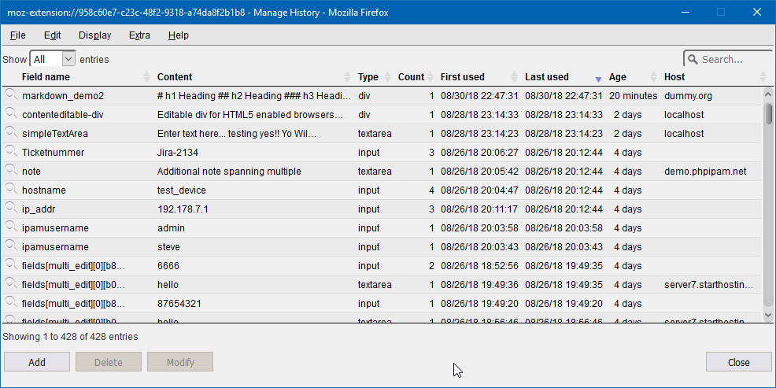

# Introduction

## Why you might need this plugin
This plugin displays all form data that has been saved by the web browser with options to filter the
data either by keyword, active page, active field or cleanup criteria. It is furthermore possible to
sort the data by parameter including form field name, value, date or popularity.

This plugin stores text from editor fields as you type, so you never have to loose your work when
disaster strikes. Recover your lost work after session timeouts, network failures, browser crashes,
power failures, and all other things that will destroy the hard work you just put into writing that
important email, essay or blog post.

This plugin lets you easily search the complete history and selectively delete all data you do not wish
to be stored for eternity.

## Opening Form History Control
Form History Control can be opened in several different ways:

- Left-click on the Form History Control icon in the toolbar. This wil bring up the small Form History Control
  popdown dialog giving access to the basic functions. Use this version to quickly access the basic functions.
- Right-click on the Form History Control icon in the toolbar. This will display a context menu from which
  tou can open the full featured popdown Form History Control dialog and provides access to all the goodies this
  add-on has to offer.
- From within the browser window: right-click to show the context menu, Form History Control is listed as
  a submenu
- The Tools menu in the menubar of the browser contains a Form History Control submenu from which you can
  either open the main dialog or access its preferences.

## The small popdown dialog
Open with left-click on FHC toolbar icon.

The FHC popdown dialog provides a way of quickly accessing the basic functions while you are browsing the web

## The main dialog
Open with right-click on FHC toolbar icon.

The main Dialog

## Context menu

## Preferences

### Clean-up

cleanup info...

### Themes

#### Dark Theme

#### Default theme

## Import / Export

### Export

### Import

## View / Edit entries

### View entry

### Edit entry

