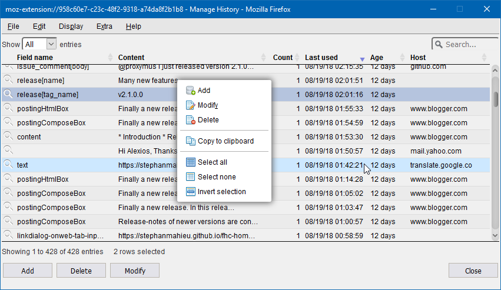
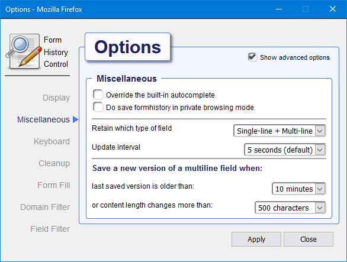
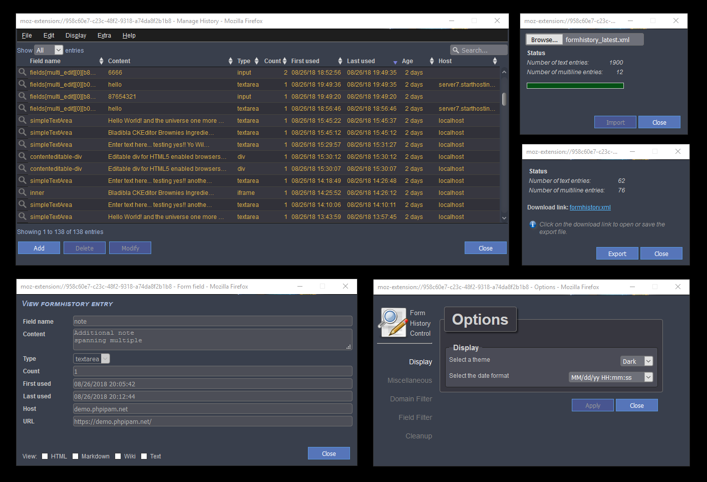

# Introduction

## Why you might need this plugin
This plugin displays all form data that has been saved by the web browser with options to filter the
data either by keyword, active page, active field or cleanup criteria. It is furthermore possible to
sort the data by parameter including form field name, value, date or popularity.

This plugin stores text from editor fields as you type, so you never have to loose your work when
disaster strikes. Recover your lost work after session timeouts, network failures, browser crashes,
power failures, and all other things that will destroy the hard work you just put into writing that
important email, essay or blog post.

This plugin lets you easily search the complete history and selectively delete all data you do not wish
to be stored for eternity.

## Installation
Install Form History Control from the Firefox [add-ons page](https://addons.mozilla.org/firefox/addon/form-history-control/).
Use the **[+ Add to Firefox]** button.

After installation you may want to add the Form History Control Icon to the tool-bar.
Choose customize from the Firefox menu and drag the icon to the desired position.

See [add FHC to the toolbar](./images/AddingToolbaricon-Animated.gif) for an animation on how to do that.

## Opening Form History Control
Form History Control can be opened in several different ways:

- Left-click on the Form History Control icon in the toolbar. This wil bring up the small Form History Control
  popdown dialog giving access to the basic functions. Use this version to quickly access the basic functions.
- Right-click on the Form History Control icon in the toolbar. This will display a context menu from which
  tou can open the full featured popdown Form History Control dialog and provides access to all the goodies this
  add-on has to offer.
- From within the browser window: right-click to show the context menu, Form History Control is listed as
  a submenu
- The Tools menu in the menubar of the browser contains a Form History Control submenu from which you can
  either open the main dialog or access its preferences.

## The small popdown dialog
Open with left-click on FHC toolbar icon.

The FHC popdown dialog provides a way of quickly accessing the basic functions while you are browsing the web.
It offers a basic limited set of features.

_To access the complete set of features, open [The main dialog](#the-main-dialog) by right clicking the FHC toolbar icon._

Right-clicking on an item in the list will show a context menu from which you can delete or modify the item.
You can also copy the value for the item you clicked to the clipboard.

The searchbox on top will let you filter the list on any fieldname, value, type or URL.
You can search on multiple keywords by separating them with a space.

To view de details for an item in the list without closing the list itself, click the + symbol on the left.
To see the details in a separate window double-click the item, a [View Entry](#view-entry) dialog will open.

[See the popdown in action!](./images/Popdown-Animated.gif)

## The main dialog
Open the main dialog by right-clicking on Form History Control toolbar icon.

The main Dialog provides access to all available features. In addition to the limited popdown dialog
it has an extra menu-bar on top giving access to additional features.
The main dialog also allows you to perform operations on multiple selected items at once.

Right-clicking on a list item opens a context-menu which allows you to perform some operations on the clicked item only.
In order to perform an action on multiple selected items at once choose the desired operation from the edit-menu in the
menubar on top.

The searchbox on top will let you filter the list on any fieldname, value, type or URL.
You can search on multiple keywords by separating them with a space.

To see the details in a separate window double-click the item, a [View Entry](#view-entry) dialog will open.
Right-clicking and selecting modify will open the [Edit Entry](#edit-entry) dialog.
It is also possible to add a complete new item.

[See the Main dialog in action!](./images/Popup-Animated.gif)

## Context menu

When Form History Control is installed, you can right-click in the browser window to bring up the context menu.
At the bottom of the context menu a Form History Control submenu will be present, from this submenu you can 
open the Main Form History Control dialog (first menu item), Restore/Fill form fields in the
current displayed webpage and more. 

  
[See the context menu in action!](./images/Contextmenu-Animated.gif)

## Page menu

When Form History Control is installed, the address bar of the browser will show a black and white Form History Control
icon from which the context-menu (right click) or the page-menu (left click) can be opened.

The page-menu provides quick access to the main dialog as well as the possibility to instantly blacklist the current
page (if enabled in preferences) or toggle the textfield information for the current page.

  
[See the page menu in action!](./images/Pagemenu-Animated.gif)

## Preferences

Use the preferences window to manage various options that alter the behaviour of the Form History Control plugin.

There are multiple ways to open the preferences dialog:

- Right-click on the FHC toolbar icon will show a context menu, under submenu 'more..' you find a preferences options.
- From the main dialog or thge popdown dialog, the little cog icon on the top right hand corner will also open the
  preferences dialog.
- Opening the add-ons page from the Firefox menu will show all installed add-ons, on the right-side of Form History Control
  there is a Preferences button that will also show the preferences but in a browser window instead of a separate dialog

### Miscellaneous

**Override Autocomplete**  
You can choose to override the built-in the Firefox autocomplete feature. This option disables the browser
built-in autocomplete dropdown-lists and the browser formhistory datastore and replaces it with the add-on's version.

When override is enabled the autocomplete dropdown lists are generated by the Form History Control add-on using
the formhistory exclusively maintained by this add-on.

**Multiline field version**  
Use these settings to control for multiline editor fields whether a new form history entry should de added or the last
entry should be updated.

### Domain Filter
If _Allow All_ is enabled (the default), the Form History Control add-on will remember form history for all pages.

To prevent storing history for specific pages you can either **blacklist** the domains for sites you
wish to exclude or **whitelist** the domains of sites you do wish to remember.

If either the blacklist or whitelist option is enabled the Form History Control icon in the toolbar will reflect the
current state of saving allowed (green + sign) or saving disallowed (red - sign).
 
[See the Domain Filter in action](./images/Domainfilter-Animated.gif "Domain Filter in action")

### Field Filter
To prevent storing formhistory for certain fields add the name of the field to the Field Filter list.
_Standard password type fields are never stored and do not have to be added here._

The field exclusion list is not used during the cleanup process.

### Clean-up
Automatic cleanup will periodically (every 15 minutes) remove entries from the formhistory storage if older than the
set number of days.

It is recommended that you enable this option. If the storage contains a very large number of entries the add-on can
become sluggish (particularly the popdown dialog will be affected).

Depending on the resources of the underlying system try to keep the number of entries below 2500.

### Themes

In the Display options the theme selector allows you to choose a color theme for the Form Histor6y Control.
When choosing a different theme, the preference dialog is immediately change to reflect the new setting.
Only after the _Apply_ button is clicked will the new theme be activated for all dialogs.

[See Theming in action!](./images/Themes-Animated.gif)

#### Default theme
This is the Default theme

#### Dark Theme
This is the Dark theme

#### Blue Theme
This is the Blue theme

## Import / Export
Exporting lets you save the content of the current collected set of form history items to a single (XML) file.
Importing reads all form history items from an export file back into your collection.

You can use the Export / Import as a backup mechanism, you can also use it to transfer your collection from one device
to another.

Import and export is available from the File submenu in the menu-bar of [The main dialog](#the-main-dialog).

### Export
Open the Export dialog from the File submenu in the menu-bar of [The main dialog](#the-main-dialog).

After the Export dialog is opened, the form history is immediately made available for export. Due to browser safety
restrictions the file will not be saved automatically. If the formhistory store is not empty the dialog will display the
number of fields it has prepared for export and show a clickable download link.

In order to open or save the file click on the download link, the browser will then give you the option to either save
or open the data.
Instead of left-click you can also do a right-click and choose the option 'Save link as...' from the menu.   

[See Exporting entries in action!](./images/Export-Animated.gif)

### Import
Open the Import dialog from the File submenu in the menu-bar of [The main dialog](#the-main-dialog).

Click the browse button and open a previously saved export file. XML-Files exported from older versions of
Form History Control are supported. 

After choosing the file hit the Import button. Duplicate fields already present will not be imported.
When the import succeeds, the dialog will display the amount of text-fields and editor-fields that have been imported
(including duplicate fields).

[See Importing entries in action!](./images/Import-Animated.gif)

## View / Edit entries

By double clicking on a formhistory item in the list or by choosing modify or add from the menu, a dialog will appear
offering more details to either modify or add various aspects of a formhistory item.

### View entry
Displays all aspects stored for a particular entry.

Right-clicking will reveal a context-menu offering the option top either copy only the clean text from a value or the
raw value including any markup information it may contain.

Radio-boxes at the bottom make it possible to render a preview according to different formats like HTML, Markdown or Wiki. 

To close the preview deselect the current checked box.

### Edit entry
Displays all aspects stored for a particular entry.
Cnange any value you like,

When multiple items are selected the edit dialog will initially display empty fields and only the count and dates can be changed.
The title on top of the dialog will inform you that you are about to change multiple items at once.