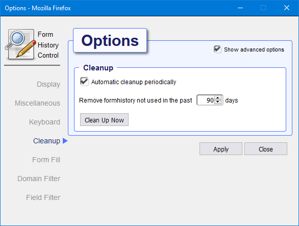
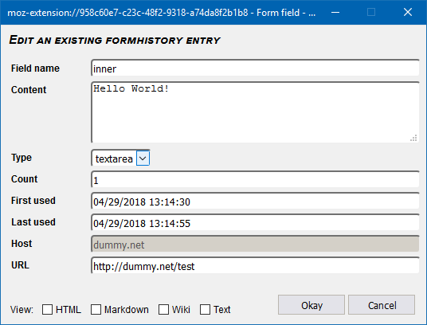

# Introduction

## Why you might need this plugin
This plugin stores text from editor fields as you type, so you never have to loose your work when
disaster strikes. Recover your lost work after session timeouts, network failures, browser crashes,
power failures, and all other things that will destroy the hard work you just put into writing that
important email, essay or blog post.

Once installed, the plugin can display all form data that has been saved with options to filter the
data by keywords and type. It is also possible to sort the data by form field name, value, date or popularity.

This plugin lets you easily search the complete history and selectively delete all data you do not wish
to be stored.

## Installation
 **Firefox:**    
Install Form History Control from the Firefox [add-ons page](https://addons.mozilla.org/firefox/addon/form-history-control/).
Use the **[+ Add to Firefox]** button.

After installation you may want to add the Form History Control Icon to the tool-bar.
Choose customize from the Firefox menu and drag the icon to the desired position.

See [add FHC to the toolbar](./images/AddingToolbaricon-Animated.gif) for an animation on how to do that.

 **Chrome:**      
Install Form History Control from the [Chrome web store](https://chrome.google.com/webstore/detail/form-history-control-ii/lpcccgcdjibejkgiaeijbmkpbnbkglkb).
Use the **[+ Add to Chrome]** button and follow the instructions.

## Opening Form History Control
Form History Control can be opened in several different ways:

- Left-click on the Form History Control icon in the toolbar. This wil bring up the small Form History Control
  popdown dialog giving access to the basic functions. Use this version to quickly access the basic functions.
- Right-click on the Form History Control icon in the toolbar. This will display a context menu from which
  tou can open the full featured popdown Form History Control dialog and provides access to all the goodies this
  add-on has to offer.
- From within the browser window: right-click to show the context menu, Form History Control is listed as
  a submenu
- The Tools menu in the menubar of the browser contains a Form History Control submenu from which you can
  either open the main dialog or access its preferences.

## The small popdown dialog
Open with left-click on FHC toolbar icon.

The FHC popdown dialog provides a way of quickly accessing the basic functions while you are browsing the web.
It offers a basic limited set of features.

_To access the complete set of features, open [The main dialog](#the-main-dialog) by right clicking the FHC toolbar icon._

Right-clicking in the list will show a context menu from which you can delete, modify or copy an item.
The menu action wil act upon the selected item or if nothing was selected it will act upon the right-clicked item.  
Choosing copy will copy the value of the item to the clipboard.

These shortcut keys are also available:  
`Ctrl+C`: copy formhistory value of first selected item to clipboard  
`Shift+Ctrl+C`: copy formhistory value without formatting    
`Del key`: delete selected item(s)

The searchbox on top will let you filter the list on any fieldname, value, type or URL.
You can search on multiple keywords by separating them with a space.

To view de details for an item in the list without closing the list itself, click the + symbol on the left.
To see the details in a separate window double-click the item, a [View Entry](#view-entry) dialog will open.

[See the popdown in action!](./images/Popdown-Animated.gif)

## The main dialog
Open the main dialog by right-clicking on Form History Control toolbar icon.

The main Dialog provides access to all available features. In addition to the limited popdown dialog
it has an extra menu-bar on top giving access to additional features.
The main dialog also allows you to perform operations on multiple selected items at once.

Right-clicking in the list will show a context menu from which you can delete, modify or copy items.
The menu action wil act upon all selected items or if nothing was selected it will act upon the item that was right-clicked.    
Choosing copy will copy the value of the item to the clipboard _(if multiple items are selected only the value of the
first item will be copied)_.

These shortcut keys are also available:  
`Ctrl+A`: select all entries    
`Ctrl+C `: copy formhistory value of first selected item to clipboard  
`Shift+Ctrl+C`: copy formhistory value without formatting    
`Del key`: delete selected item(s)

To perform an action on selected items you can also select the desired operation from the edit-menu in the
menubar on top.

The searchbox on top will let you filter the list on any fieldname, value, type or URL.
You can search on multiple keywords by separating them with a space.

To see the details in a separate window double-click the item, a [View Entry](#view-entry) dialog will open.
Right-clicking and selecting modify will open the [Edit Entry](#edit-entry) dialog.
It is also possible to add a complete new item.

[See the Main dialog in action!](./images/Popup-Animated.gif)

## Context menu

When Form History Control is installed, you can right-click in the browser window to bring up the context menu.
At the bottom of the context menu a Form History Control submenu will be present, from this submenu you can 
open the Main Form History Control dialog (first menu item), Restore/Fill form fields in the
current displayed webpage and more. 

  
[See the context menu in action!](./images/Contextmenu-Animated.gif)

## Page menu
 **Firefox only!**    
When Form History Control is installed, the address bar of the browser will show a black and white Form History Control
icon from which the context-menu (right click) or the page-menu (left click) can be opened.

The page-menu provides quick access to the main dialog as well as the possibility to instantly blacklist the current
page (if enabled in preferences) or toggle the textfield information for the current page.

  
[See the page menu in action!](./images/Pagemenu-Animated.gif)

## Preferences

Use the preferences window to manage various options that alter the behaviour of the Form History Control plugin.

Note that there is an advanced options checkbox that unlocks additional settings.

There are multiple ways to open the preferences dialog:

- Right-click on the FHC toolbar icon will show a context menu, under submenu 'more..' you find a preferences options.
- From the main dialog or thge popdown dialog, the little cog icon on the top right hand corner will also open the
  preferences dialog.
- Opening the add-ons page from the browser menu will show all installed add-ons, on the right-side of Form History Control
  there is a Preferences button that will also show the preferences but in a browser window instead of a separate dialog

### Display

**Select a Theme**  
Select the theme to use. See the [themes](#themes) section for detailed information on how this works.

**Select the data format**  
Choose the date format, select _automatic_ (default) to use the date format as set on the local system.

**Remember window size and position**  
When activated the size and position of each opened Form History Control window and dialog will be remembered.
Use the _**Reset**_ button to reset all sizes and positions back to default.

**Mousewheel scroll amount**  
This controls how many pixels the list of formhistory will move when using the mousewheel.
Selecting _automatic_ (default) will approximately scroll the amount of visible entries up or down.

**Context menu**  
Controls where to provide a right-click context menu for Form History Control. The option "_Always available_" allows
the context menu to be opened anywhere on a page by left clicking. The option "_On edit fields only_" will show the
context menu only when left clicking inside a form field. To completely disable the context menu choose option
"_No context menu_".

**Address bar icon**  
Choose here whether to always show the Formhistory control icon in the addressbar or always hide it. The icon
provides access to the context-menu (right click) or the page-menu (left click) .

### Miscellaneous

**Override Autocomplete**  
You can choose to override the built-in autocomplete feature. This option disables the browser
built-in autocomplete dropdown-lists and the browser formhistory datastore and replaces it with the add-on's version.

When override is enabled the autocomplete dropdown lists are generated by the Form History Control add-on using
the formhistory exclusively maintained by this add-on.

**Save in private browsing mode**  
Data gathered while private browsing mode is active is not being stored unless this is explicitly activated.

**Retain which type of field**   
Choose for which type of fields data should be stored.

**Update interval**   
Data is stored periodically while typing. Increasing the interval will put less strain on disk usage,
decreasing the interval will limit the risk of data loss.

**Multiline field version**  
Use these settings to control for multiline editor fields whether a new form history entry should be added or the last
entry should be updated.

### Keyboard
Shortcut keys can be assigned to a variety of actions (Google Chrome allows at most 4). You can for example assign a
shortcut key combination to open the Form History Dialog or directly perform an action like filling all
fields with the most recent entries.

The overview shown is read-only, keyboard shortcuts are now centrally managed from the add-ons page.

To change keyboard shortcuts you have to use the browsers **extensions page**:

#### Firefox shortcuts

1. Click the Firefox hamburger menu icon
2. click "_Add-ons and themes_" and select "_Extensions_"
3. Click the Tools for all add-ons cogwheel
4. Click "_Manage Extension Shortcuts_" in the menu

#### Chrome shortcuts

1. Click the three-dot Menu icon in the top-right corner
2. Click "_Extensions_" and select "_Manage Extensions_"
3. On the left, click "_Keyboard shortcuts_" 

### Clean-up
Automatic cleanup will periodically (every 15 minutes) remove entries from the formhistory storage if older than the
set number of days.

It is recommended that you enable this option. If the storage contains a very large number of entries the add-on can
become sluggish (particularly the popdown dialog will be affected).

Depending on the resources of the underlying system try to keep the number of entries below 2500.

### Form Fill
Control how multiline form fields should be filled.

**Field Fill mode options:**

* **Automatic:**  
insert the formhistory entry directly into the formfield if the entry consists of plain text,
otherwise copy it to the clipboard instead
* **Use clipboard:**  
always copy the formhistory entry to the clipboard
* **Insert clean text only:**  
remove any formatting code from the entry and insert the remaining plain text into the formfield
* **Insert entire (raw) content:**  
Always insert the entire content into the formfield 

### Domain Filter
If _Allow All_ is enabled (the default), the Form History Control add-on will remember form history for all pages.

To prevent storing history for specific pages you can either **blacklist** the domains for sites you
wish to exclude or **whitelist** the domains of sites you do wish to remember.

If either the blacklist or whitelist option is enabled the Form History Control icon in the toolbar will reflect the
current state of saving allowed (green + sign) or saving disallowed (red - sign).

Wildcard `*` may be used at the beginning and/or the end of a host.
For example filtering on *domain.com will not only match `http://domain.com/page` but also match a subdomain
like `http://sub.domain.com/page`.
 
[See the Domain Filter in action](./images/Domainfilter-Animated.gif "Domain Filter in action")

### Field Filter
To prevent storing formhistory for certain fields add the name of the field to the Field Filter list.
_Standard password type fields are never stored and do not have to be added here._

Wildcard `*` may be used at the beginning and/or end of a field.
To match only fields on a specific host the field may also be prefixed with the host separated by a colon.
For example to match field `foo` only for host `domain.com` use: `domain.com:foo`.
Wildcard `*` may also be used at the beginning and/or the end of the host.  
Special keyword _&lt;empty&gt;_ matches anonymous fields (fields that have no name or id).

The field exclusion list is not used during the cleanup process.

### Themes

In the Display options the theme selector allows you to choose a color theme for the Form Histor6y Control.
When choosing a different theme, the preference dialog is immediately change to reflect the new setting.
Only after the _Apply_ button is clicked will the new theme be activated for all dialogs.

[See Theming in action!](./images/Themes-Animated.gif)

#### Default theme
This is the Default theme

#### Dark Theme
This is the Dark theme

#### Blue Theme
This is the Blue theme

## Import / Export
Exporting lets you save the content of the current collected set of form history items to a single (XML) file.
Importing reads all form history items from an export file back into your collection.

You can use the Export / Import as a backup mechanism, you can also use it to transfer your collection from one device
to another.

Import and export is available from the File submenu in the menu-bar of [The main dialog](#the-main-dialog).

### Export
Open the Export dialog from the File submenu in the menu-bar of [The main dialog](#the-main-dialog).

After clicking the Export button all form history items will be collected and a filebrowser dialog will appear offering
you to save the file to your local storage.

If you use the export function for the first time you may be asked to [grant the additional _Download_ permission](./images/Export-grant.png).
Allowing the download permission will continue the export, denying the permission will abort the export and you will be
asked to grant this permission again the next time you try to export.

[See Exporting entries in action!](./images/Export-Animated.gif)

### Import
Open the Import dialog from the File submenu in the menu-bar of [The main dialog](#the-main-dialog).

Click the browse button and open a previously saved export file. XML-Files exported from older versions of
Form History Control are supported. 

After choosing the file hit the Import button. Duplicate fields already present will not be imported.
When the import succeeds, the dialog will display the amount of text-fields and editor-fields that have been imported
(including duplicate fields).

[See Importing entries in action!](./images/Import-Animated.gif)

## View / Edit entries

By double clicking on a formhistory item in the list or by choosing modify or add from the menu, a dialog will appear
offering more details to either modify or add various aspects of a formhistory item.

### View entry
Displays all aspects stored for a particular entry.

Right-clicking will reveal a context-menu offering the option top either copy only the clean text from a value or the
raw value including any markup information it may contain.

Radio-boxes at the bottom make it possible to render a preview according to different formats like HTML, Markdown or Wiki. 

To close the preview deselect the current checked box.

### Edit entry
Displays all aspects stored for a particular entry.
Cnange any value you like,

When multiple items are selected the edit dialog will initially display empty fields and only the count and dates can be changed.
The title on top of the dialog will inform you that you are about to change multiple items at once.

## Show Fields on the current page

The Show fields option discovers all form fields displayed on the current page and adds a label next to each field
revealing more detailed info when clicked.  

This option acts like a toggle, invoke it again to remove the form field info labels.
